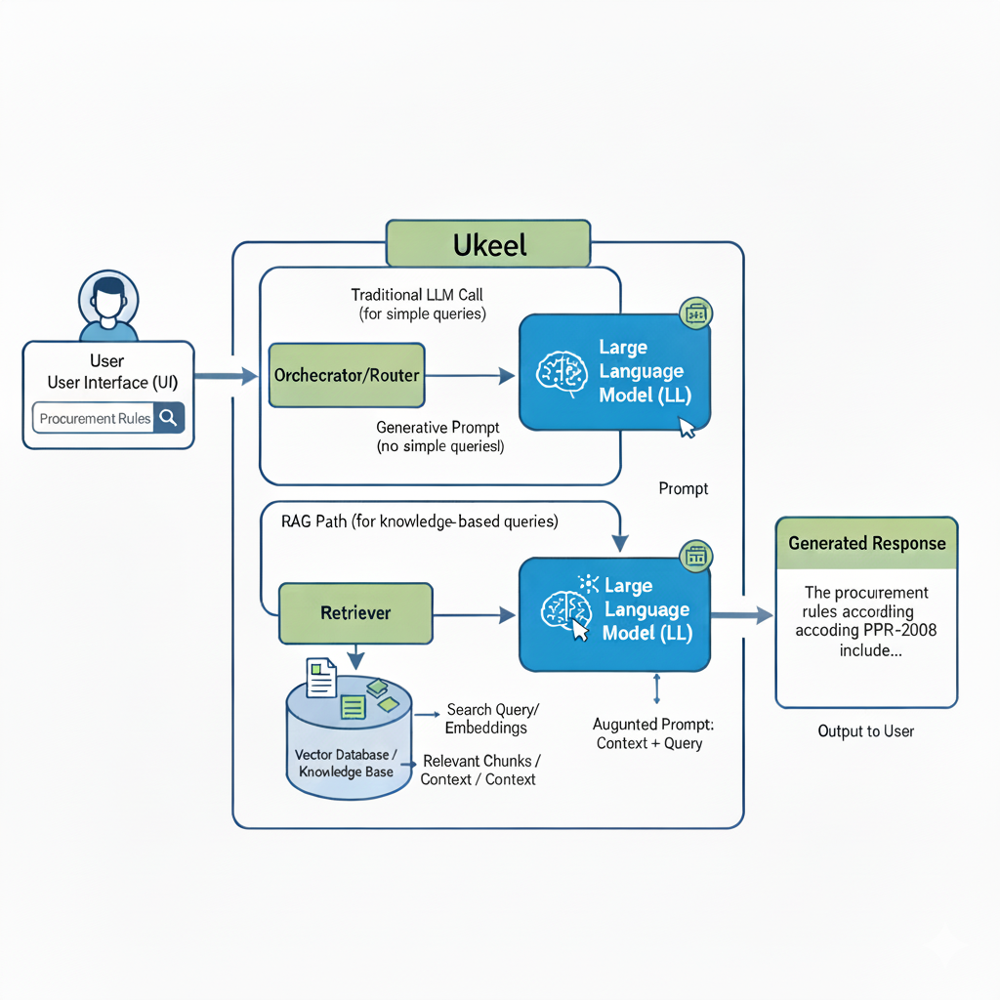
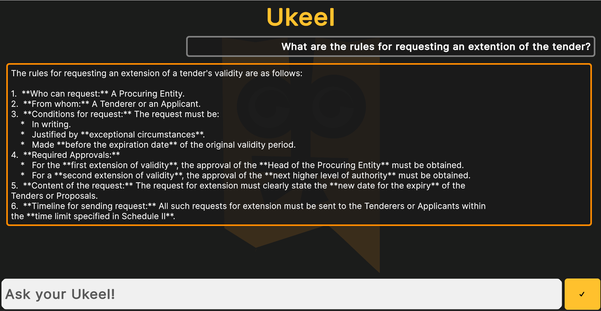

# Ukeel
**AI based Government Compliance Tool created by Team Ambiverts for 'PTIB CIVIC TECH CHALLENGE 2025'**

Government office paperwork is slow, error-prone, and lacks transparency, leading to public suffering. Manual contract verification against complex regulations is inefficient, risks
overlooking critical details and delays crucial government services. An automated, reliable, and transparent system is needed to speed up processing, minimize errors, and strengthen public
trust in governance.

Our solution, Ukeel, is an AI-powered assistant designed to streamline government office workflows by automating contract verification and compliance checks. A citizen/government officer
uploads a draft contract, and Ukeel cross-checks it against current regulations using Retrieval-Augmented Generation (RAG). The bot identifies risks, missing details, orinconsistencies and generates a refined, legally sound version ready for approval. Unlike traditional manual review, Ukeel ensures speed, accuracy, and transparency while maintaining compliance with government standards. Its unique features include real-time regulatory checks, automated risk reporting, and generation of a signable PDF contract. By reducing delays and human error, Ukeel makes governance more efficient, minimizes public suffering, and fosters accountability and trust between citizens and government.

